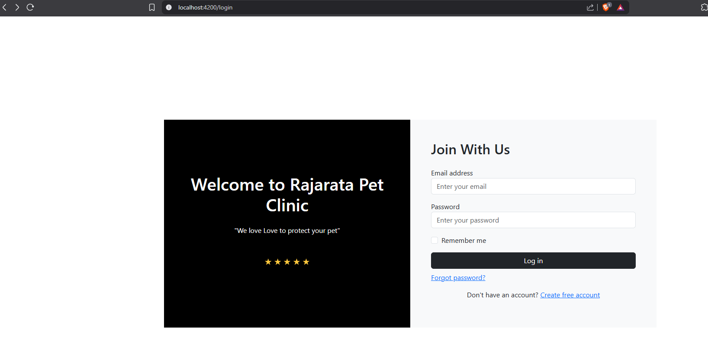
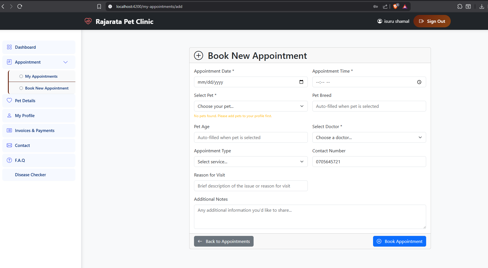
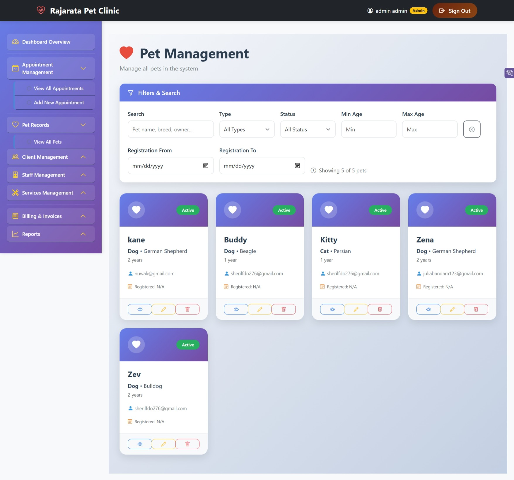
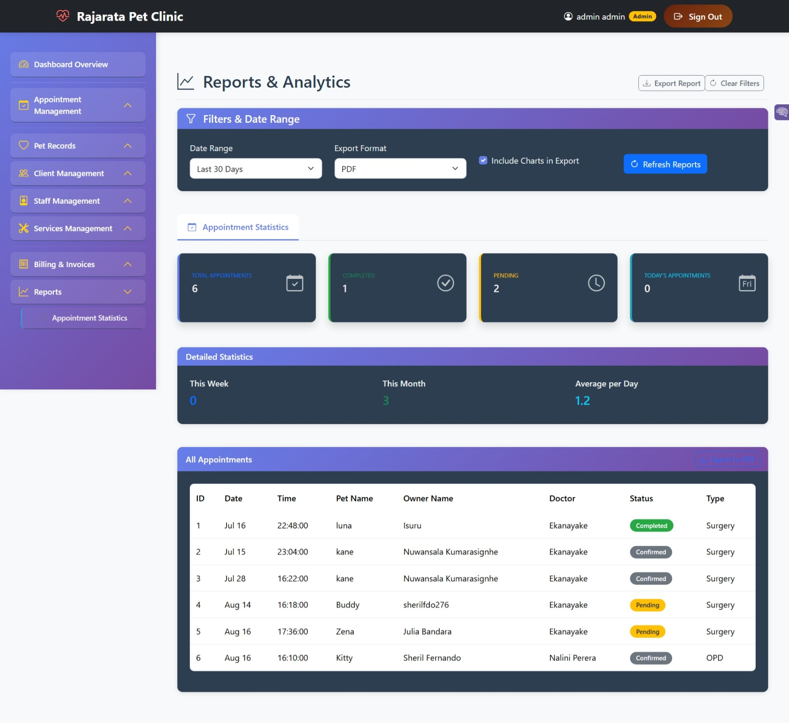

# 🐾 Rajarata Pet Clinic Management System

> A full-stack web-based veterinary clinic management system designed to digitize clinic operations, improve appointment management, centralize pet medical information, and provide symptom-based clinical decision support.


---

## 📌 Project Overview

The **Rajarata Pet Clinic Management System (RPCMS)** is a full-stack web application developed to modernize the manual processes of a veterinary clinic.

The system provides a centralized platform for managing:

- 👤 User authentication and access
- 📅 Veterinary appointments
- 🐶🐱 Pet and owner information
- 🩺 Medical and treatment records
- 🔎 Symptom-based disease diagnosis
- 💰 Billing and invoices
- 💬 Customer communication
- 📊 Clinic reports and analysis
- 👨‍⚕️ Doctor and service management

The system was designed around the operational requirements of a small veterinary clinic and provides a foundation that can be extended with additional roles, reporting, financial functionality, notifications, and AI-enhanced diagnosis in future versions.

---

## 🎯 Problem Statement

Many small veterinary clinics still depend on manual processes for managing appointments, pet records, owner information, and clinic activities.

These processes can lead to:

- Difficulty maintaining organized medical records
- Inefficient appointment management
- Limited access to historical pet information
- Manual administrative workflows
- Difficulty monitoring clinic activities
- Lack of digital decision-support tools

RPCMS addresses these challenges by bringing the core clinic workflows into a centralized web-based platform.

---

# 💡 Key Features

### 🔐 Authentication & Access Control

- User registration
- Secure login
- Password recovery
- Role-based access
- Protected application routes

 

### 📅 Appointment Management

- Appointment scheduling
- Appointment availability
- Calendar-based appointment management
- Appointment status tracking
- Admin-side appointment management
- Customer appointment management

 

### 🐾 Pet Management

- Register pets
- Maintain pet profiles
- Store breed and age information
- Record vaccination information
- Maintain notes and pet-related information
- Associate pets with their owners



### 🩺 Medical Record Management

- Maintain treatment-related information
- Store pet medical information
- Access historical pet information
- Connect services and treatment records with pets

### 💰 Billing & Invoice Management

- Create invoices
- Add services
- Maintain invoice records
- Track payment-related information
- Apply tax and discount information

### 📊 Reports & Analysis

- Appointment summaries
- Date-based filtering
- Doctor-based filtering
- Appointment status filtering
- Clinic activity analysis
- Appointment workload monitoring



### 💬 Communication Management

- Customer contact messages
- Complaint/question submission
- Admin-side message management
- Email-based response functionality

---

# 🔎 Symptom-Based Disease Diagnosis System

One of the key technical features of RPCMS is the **Symptom-Based Disease Diagnosis Module**.

Rather than simply storing medical information, the system provides a structured **rule-based expert system** that analyzes symptoms entered into the system and produces possible diagnoses with supporting clinical information.

The current implementation uses structured rules rather than a machine-learning model.

### How it works

```text
User / Practitioner enters symptoms
                ↓
        Input validation
                ↓
      Rule-based inference engine
                ↓
        Symptom matching
                ↓
      Rule evaluation process
                ↓
       Possible diagnosis
                ↓
 Recommended clinical information

```
# 🛠️ Technology Stack

| Layer                       | Technology         |
| --------------------------- | ------------------ |
| **Frontend**                | Angular            |
| **Backend**                 | Laravel            |
| **Programming Languages**   | TypeScript, PHP    |
| **Database**                | MySQL              |
| **Authentication**          | Laravel Sanctum    |
| **UI Framework**            | Bootstrap          |
| **Notifications**           | Toastr             |
| **Email Service**           | Mailjet            |
| **Development Environment** | Visual Studio Code |
| **Local Server**            | XAMPP / Apache     |


# 📄 Project Purpose
This project was developed for academic and educational purposes to demonstrate practical skills in full-stack web application development and software engineering.

⭐ If you find the project useful or interesting, consider giving the repository a star.


